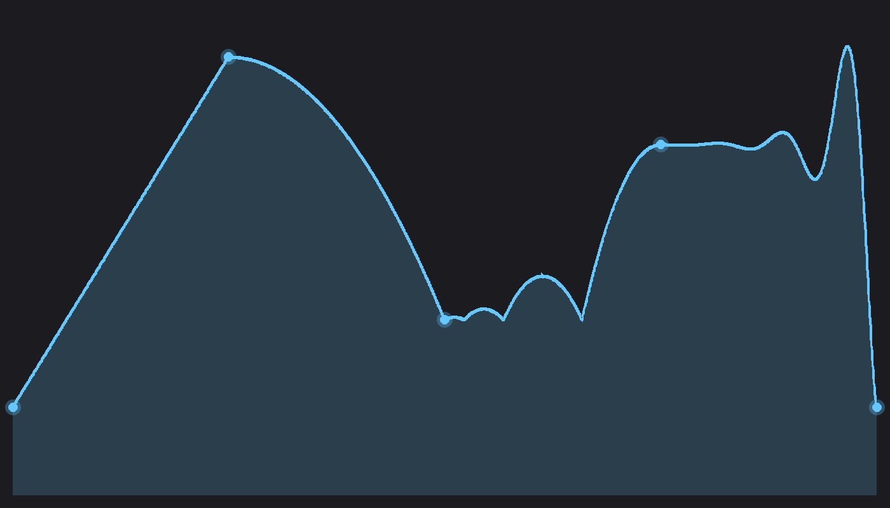

# audio-automation

[](https://github.com/PoHsuanLai/audio-automation/actions)
[](https://crates.io/crates/audio-automation)
[](https://docs.rs/audio-automation)
[](LICENSE-MIT)

Time-based parameter automation with interpolation curves for audio applications.



## Usage

```rust
use audio_automation::prelude::*;

let mut env = AutomationEnvelope::new("volume");
env.add_point(AutomationPoint::new(0.0, 0.0));
env.add_point(AutomationPoint::with_curve(4.0, 1.0, CurveType::Exponential));

let value = env.get_value_at(2.0).unwrap(); // interpolated value
```

## Curve types

`Linear`, `Exponential`, `Logarithmic`, `SCurve`, `Stepped`, `Bezier`, `Elastic`, `Bounce`, `Back`, `Circular`, and polynomial easing variants.

## License

MIT or Apache-2.0
